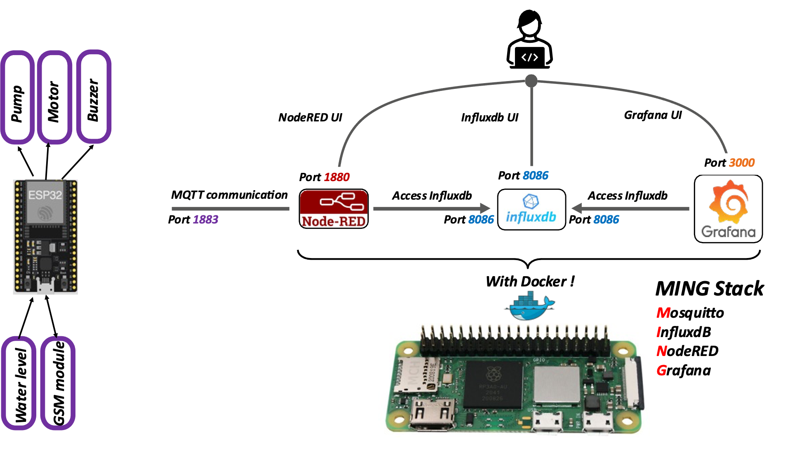
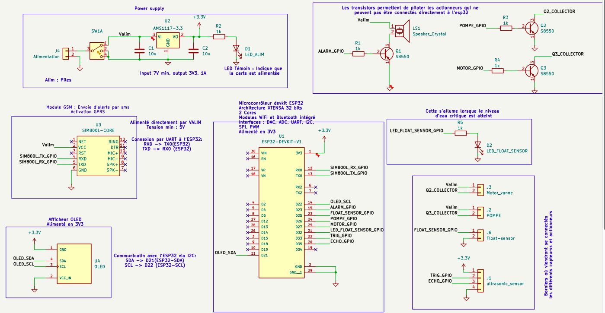
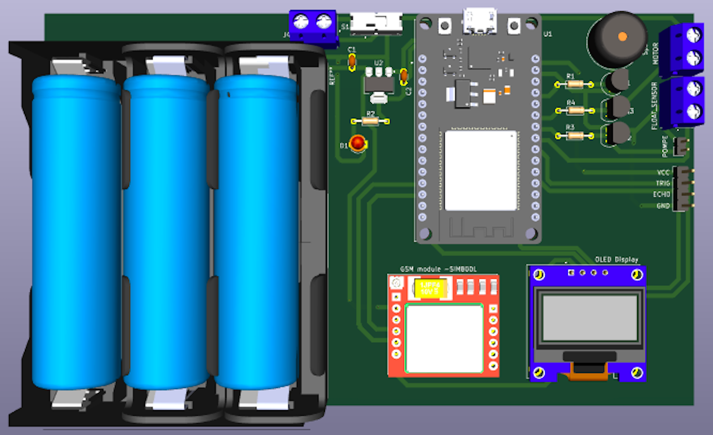

# Système anti inondation
[https://github.com/Korotaa/ANTI_FLOODING_SYSTEM](https://github.com/Korotaa/ANTI_FLOODING_SYSTEM)
## I. Besoins du système  
1. Détection proactive des niveaux d’eau à l’aide de capteurs robustes.
2. Actionnement automatisé pour évacuation d’eau via une pompe submersible.
3. Signalisation locale et/ou à distance en cas de risque.
4. Résilience énergétique grâce à une batterie de secours.
## II. Design contraintes
1. Fiabilité : Utilisation de capteurs et d’actionneurs éprouvés.
2. Accessibilité : Matériel standard et technologies abordables.
3. Évolutivité : Possibilité d’intégrer des fonctionnalités avancées comme la communication IoT.
##  III. Architecture

## IV. schéma électronique du End-device

## V. PCB

